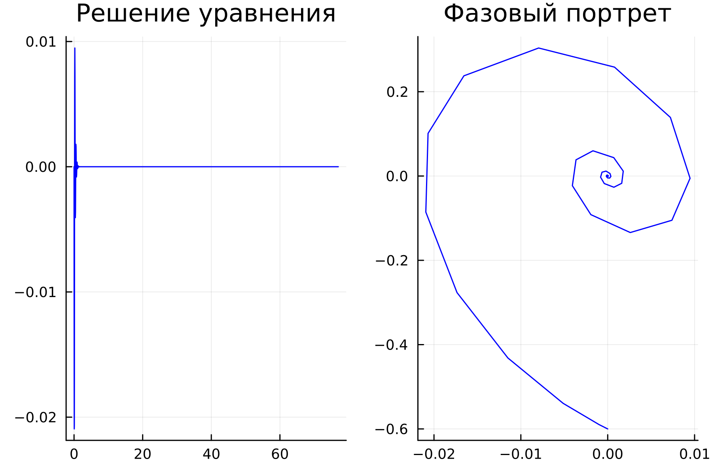
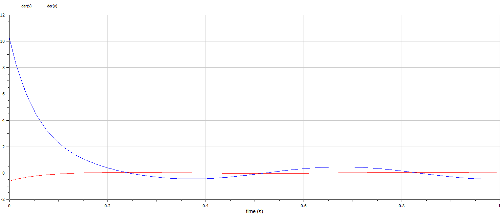

---
## Front matter
title: "Отчёт по лабораторной работе №4


Математическое моделирование"
subtitle: "Модель гармонических колебаний. Вариант №59"
author: "Выполнил: Мальков Роман Сергеевич, 


НФИбд-02-21, 1032217048"


## Generic otions
lang: ru-RU
toc-title: "Содержание"

## Bibliography
bibliography: bib/cite.bib
csl: pandoc/csl/gost-r-7-0-5-2008-numeric.csl

## Pdf output format
toc: true # Table of contents
toc-depth: 2
lof: true # List of figures
fontsize: 12pt
linestretch: 1.5
papersize: a4
documentclass: scrreprt
## I18n polyglossia
polyglossia-lang:
  name: russian
  options:
	- spelling=modern
	- babelshorthands=true
polyglossia-otherlangs:
  name: english
## I18n babel
babel-lang: russian
babel-otherlangs: english
## Fonts
mainfont: Times New Roman 
romanfont: Times New Roman 
sansfont: Times New Roman 
monofont: Times New Roman 
mainfontoptions: Ligatures=TeX
romanfontoptions: Ligatures=TeX
sansfontoptions: Ligatures=TeX,Scale=MatchLowercase
monofontoptions: Scale=MatchLowercase,Scale=0.9
## Biblatex
biblatex: true
biblio-style: "gost-numeric"
biblatexoptions:
  - parentracker=true
  - backend=biber
  - hyperref=auto
  - language=auto
  - autolang=other*
  - citestyle=gost-numeric
## Pandoc-crossref LaTeX customization
figureTitle: "Рис."
tableTitle: "Таблица"
listingTitle: "Листинг"
lofTitle: "Список иллюстраций"
lolTitle: "Листинги"
## Misc options
indent: true
header-includes:
  - \usepackage{indentfirst}
  - \usepackage{float} # keep figures where there are in the text
  - \floatplacement{figure}{H} # keep figures where there are in the text
---

# Цель работы

Изучить понятие гармонического осциллятора, построить фазовый портрет и найти решение уравнения гармонического осциллятора.

# Теоретическое введение

- Гармонический осциллятор [1] — система, которая при смещении из положения равновесия испытывает действие возвращающей силы F, пропорциональной смещению x.

- Гармоническое колебание [2] - колебание, в процессе которого величины, характеризующие движение (смещение, скорость, ускорение и др.), изменяются по закону синуса или косинуса (гармоническому закону).

Движение грузика на пружинке, маятника, заряда в электрическом контуре, а также эволюция во времени многих систем в физике, химии, биологии и других науках при определенных предположениях можно описать одним и тем же дифференциальным уравнением, которое в теории колебаний выступает в качестве основной модели. Эта модель называется линейным гармоническим осциллятором.
Уравнение свободных колебаний гармонического осциллятора имеет следующий вид:
$$\ddot{x}+2\gamma\dot{x}+\omega_0^2=0$$

где $x$ - переменная, описывающая состояние системы (смещение грузика, заряд конденсатора и т.д.), $\gamma$ - параметр, характеризующий потери энергии (трение в механической системе, сопротивление в контуре), $\omega_0$ - собственная частота колебаний.
Это уравнение есть линейное однородное дифференциальное  уравнение второго порядка и оно является примером линейной динамической системы.

При отсутствии потерь в системе ( $\gamma=0$ ) получаем уравнение консервативного осциллятора энергия колебания которого сохраняется во времени.
$$\ddot{x}+\omega_0^2x=0$$

Для однозначной разрешимости уравнения второго порядка необходимо задать два начальных условия вида
 
$$
 \begin{cases}
	x(t_0)=x_0
	\\   
	\dot{x(t_0)}=y_0
 \end{cases}
$$

Уравнение второго порядка можно представить в виде системы двух уравнений первого порядка:
$$
 \begin{cases}
	x=y
	\\   
	y=-\omega_0^2x
 \end{cases}
$$

Начальные условия для системы примут вид:
$$
 \begin{cases}
	x(t_0)=x_0
	\\   
	y(t_0)=y_0
 \end{cases}
$$

Независимые	переменные	$x, y$	определяют	пространство,	в	котором «движется» решение. Это фазовое пространство системы, поскольку оно двумерно будем называть его фазовой плоскостью.

Значение фазовых координат $x, y$ в любой момент времени полностью определяет состояние системы. Решению уравнения движения как функции времени отвечает гладкая кривая в фазовой плоскости. Она называется фазовой траекторией. Если множество различных решений (соответствующих различным 
начальным условиям) изобразить на одной фазовой плоскости, возникает общая картина поведения системы. Такую картину, образованную набором фазовых траекторий, называют фазовым портретом.

# Задачи

1. Разобраться в понятии гармонического осциллятора

2. Ознакомиться с уравнением свободных колебаний гармонического осциллятора

3. Построить фазовый портрет гармонического осциллятора и решение уравнения на языках Julia и Open Modelica гармонического осциллятора для следующих случаев:

- Колебания гармонического осциллятора без затуханий и без действий внешней силы

- Колебания гармонического осциллятора c затуханием и без действий внешней силы

- Колебания гармонического осциллятора c затуханием и под действием внешней силы

# Задание

Вариант 59:

Постройте фазовый портрет гармонического осциллятора и решение уравнения гармонического осциллятора для следующих случаев:

1. Колебания гармонического осциллятора без затуханий и без действий внешней силы $\ddot{x}+30x=0$;
2. Колебания гармонического осциллятора c затуханием и без действий внешней силы $\ddot{x}+10\dot{x}+20x=0$
3. Колебания гармонического осциллятора c затуханием и под действием внешней силы $\ddot{x}+17\dot{x}+3x=0.9cos(10t)$

На интервале $t\in [0;77]$ (шаг $0.05$) с начальными условиями $x_0=0.0, y_0=-0.6$.

# Выполнение лабораторной работы

## Построение математической модели. Решение с помощью программ

### Julia

Код программы для первого случая:

```
using Plots
using DifferentialEquations

w = 30.0
g = 0.0
x₀ = 0.0
y₀ = -0.6


function ode_fn(du, u, p, t)
  x, y = u
  du[1] = u[2]
  du[2] = -(w*w)*u[1] - g*u[2]
end

v₀ = [x₀, y₀]
tspan = (0.0, 77.0)
prob = ODEProblem(ode_fn, v₀, tspan)
sol = solve(prob, dtmax=0.05)

X = [u[1] for u in sol.u]
Y = [u[2] for u in sol.u]
T = [t for t in sol.t]
plt = plot(
           layout=(1,2),
           dpi=300,
           legend=false)

plot!(
      plt[1],
      T,
      X,
      title="Решение уравнения",
      color=:blue)

plot!(
      plt[2],
      X,
      Y,
      title="Фазовый портрет",
      color=:blue)

savefig(plt, "jl1.png")
```
Код программы для второго случая:

```
using Plots
using DifferentialEquations

w = 20.0
g = 10.0
x₀ = 0.0
y₀ = -0.6


function ode_fn(du, u, p, t)
  x, y = u
  du[1] = u[2]
  du[2] = -(w*w)*u[1] - g*u[2]
end

v₀ = [x₀, y₀]
tspan = (0.0, 77.0)
prob = ODEProblem(ode_fn, v₀, tspan)
sol = solve(prob, dtmax=0.05)

X = [u[1] for u in sol.u]
Y = [u[2] for u in sol.u]
T = [t for t in sol.t]
plt = plot(
           layout=(1,2),
           dpi=300,
           legend=false)

plot!(
      plt[1],
      T,
      X,
      title="Решение уравнения",
      color=:blue)

plot!(
      plt[2],
      X,
      Y,
      title="Фазовый портрет",
      color=:blue)

savefig(plt, "jl2.png")
```

Код программы для третьего случая:

```
using Plots
using DifferentialEquations

w = 3.0
g = 17.0
x₀ = 0.0
y₀ = -0.6


function ode_fn(du, u, p, t)
  x, y = u
  du[1] = u[2]
  du[2] = -(w*w)*u[1] - g*u[2] + 0.9*cos(10*t)
end

v₀ = [x₀, y₀]
tspan = (0.0, 77.0)
prob = ODEProblem(ode_fn, v₀, tspan)
sol = solve(prob, dtmax=0.05)

X = [u[1] for u in sol.u]
Y = [u[2] for u in sol.u]
T = [t for t in sol.t]
plt = plot(
           layout=(1,2),
           dpi=300,
           legend=false)

plot!(
      plt[1],
      T,
      X,
      title="Решение уравнения",
      color=:blue)

plot!(
      plt[2],
      X,
      Y,
      title="Фазовый портрет",
      color=:blue)

savefig(plt, "jl3.png")
```

### Результаты работы кода на Julia

Первый случай: 

Колебания гармонического осциллятора без затуханий и без действий внешней силы

{#fig:001}

Второй случай:

Колебания гармонического осциллятора c затуханием и без действий внешней силы

{#fig:002}


Третий случай:

Колебания гармонического осциллятора c затуханием и под действием внешней силы

{#fig:003}

## OpenModelica

Код программы для первого случая:

```
model lab41
Real x;
Real y;
Real w = 30.0;
Real g = 0.0;
Real t = time;
initial equation
x = 0.0;
y = -0.6;
equation
der(x) = y;
der(y) = -(w*w)*x - g*y;
end lab41;
```

Код программы для второго случая:

```
model lab42
Real x;
Real y;
Real w = 20.0;
Real g = 10.0;
Real t = time;
initial equation
x = 0.0;
y = -0.6;
equation
der(x) = y;
der(y) = -(w*w)*x - g*y;
end lab42;
```

Код программы для третьего случая:

```
model lab43
Real x;
Real y;
Real w = 3.0;
Real g = 17.0;
Real t = time;
initial equation
x = 0.0;
y = -0.6;
equation
der(x) = y;
der(y) = -(w*w)*x - g*y + 0.9*sin(10*t);
end lab43;
```

### Результаты работы кода на OpenModelica

Первый случай: 

Колебания гармонического осциллятора без затуханий и без действий внешней силы

{#fig:004}

Второй случай:

Колебания гармонического осциллятора c затуханием и без действий внешней силы

{#fig:005}
Третий случай:

Колебания гармонического осциллятора c затуханием и под действием внешней силы

{#fig:006}

# Анализ полученных результатов. Сравнение языков.

В итоге проделанной работы мы построили три графика для вышеуказанных моделей на языках Julia и OpenModelica. Построение моделей колебания на языке OpenModelica занимает меньше строк, чем аналогичное построение на Julia.

# Вывод

В ходе выполнения лабораторной работы были построены решения уравнения гармонического осциллятора и фазовые портреты гармонических колебаний без затухания, с затуханием и при действии внешней силы на языках Julia и Open Modelica.
